# Seal Colony Cafe
(Developer: Christopher Faherty)

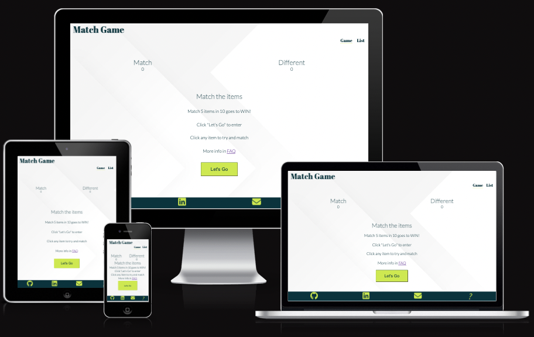

[Live Webpage](https://chrisfaherty.github.io/CI_PP2_SCC/)

## Table of Content

1. [Project Goals](#project-goals)
    1. [User Goals](#user-goals)
    2. [Return User Goals](#returning-user)
    3. [Site Owner Goals](#site-owner-goals)
2. [User Experience](#user-experience)
    1. [Target Audience](#target-audience)
    2. [User Requirements and Expectations](#user-requirements-and-expectations)
    3. [User Stories](#user-stories)
3. [Design](#design)
    1. [Design Choices](#design-choices)
    2. [Colour](#colour)
    3. [Fonts](#fonts)
    4. [Structure](#structure)
    5. [Wireframes](#wireframes)
4. [Technologies Used](#technologies-used)
    1. [Languages](#languages)
    2. [Framework and Tools](#framework-and-tools)
5. [Features](#features)
6. [Testing](#testing)
    1. [Testing user stories](#testing-user-stories)
8. [Bugs](#bugs)
9. [Deployment](#deployment)
10. [Credits](#credits)
11. [Acknowledgements](#acknowledgements)

## Project Goals

### User Goals
* Finding an add that I can use as a shopping list,
* Having a fun game on the app as well,
* Having a way to give feedback and sugestions,
* Having a minimalist design where it is only nessessary information available.

### Site Owner Goals
* Provide a way for users to add remove and mark items in a shopping list,
* Provide a fun interactive game that the user can play,
* provide a method to give product feedback for future itterations.

## User Experience

### Target Audience
* People that make lists,
* People looking to track tasks or items,
* People looking for a fun matching game.

### User Requirements and Expectations
* A intuative navigation bar,
* All relevent information can be found with out an issue,
* All buttons can be pressed easily and are large enough on all screen sizes,
* Straight forward way to add check and remove items from the list,
* A site that is Accessability focused,
* A clear method to submit feedback,
* A fun game to pass time.

### User Stories

#### First-time  User
1. As a first time user, I want to be able to intuatively tell how I use the app.
2. As a first time user, I want to be able to add remove and check list items.
3. As a first time user, I want to know how to submit feedback.
4. As a first time user, I want to know how to access and play the game.
5. As a first time user, I want to be able to reset the game to play again.

#### Returning User
6. As a returning user, I want to be able to quickly add items again and check them of during the day. 
7. As a returning user, I want to be able to access the developers links.
8. As a returning user, I want to have a target score to beat the game,
9. As a returning user , I want to be able to submit feedback.

#### Site Owner
10. As the site owner, I want users to keep up to date site updates,
11. As the site owner, I want users to be able to submit feedback.
12. As the site owner, I want users to be able to complete the tasks they require.
13. As the site owner, I want users to be able to complete the tasks they require.

## Design

### Design Choices
The site was designed to have a minimal look and highlight all the relevent components. The site was designed in a way to feel relaxing.

### Colour
The colour scheme used in this project is a white backgound with black text. This went alogn with a ocean color scheme.

### Fonts
The fonts that were chosen were Lato for the logo and Abril Fatface for the content. Both of these fonts had a fall back of sans-serif.

### Structure
The home page is structured is an intuative way where all the relevent information is presented at the correct time,
* The first screen is the info screen that lets you enter the game, With only one button you can't go wrong,
* The game is then intuative to play with text feedback and images changing depending on the button you press,
* In the nav bar you can access the list page if you want to create a list of items and tick them off as you go,
* in the footer you can find the email icon that brings you to a feedback form.

### Wireframes

Game

List

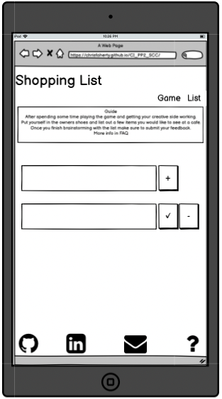

Form

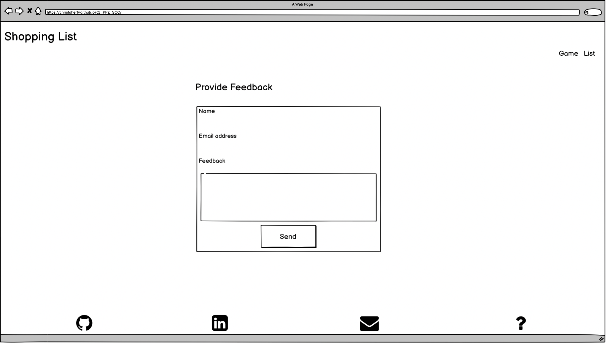

## Technologies Used

### Languages
* HTML
* CSS
* JavaScript

### Framework and Tools
* Git
* GitHub
* Gitpod
* Favicon.io
* Font Awosome
* Google Fonts
* Balsamiq
* EmailJS

## Features

### Existing Features

* Navigation Bar
    * The navigation bar is situated at the top of the page,
    * The navigation links to the game page & list are all positioned to the right hand side of the header,
    * The black text in the navigation bar links contrasts nicely with the white background and main hero image below,
    * This Navigation bar is clear to tell the website you are on and intuative to use navigation between each page.

* The Info Screen
    * The info screen is used to give the basic game rules,
    * This screen has the access button to get into the game,
    * this screen will fade away once lets go is clocked to reveal the game.

* The Game Screen
    * This is where you play the main game. There is a few options for the user to interact with the choice buttons and the reset button,
    * There is feedback when a button is clicked. The computer selects a image at the same time the user selects an image,
    * When the choice button is selected the outcome text will say if it is a match or not,
    * If it is a match it will update the score number, and the same if it is not a match,
    * If you use all 10 chances and don't get 5 matches it will say you lost the game.

* The Footer 
    * The footer section keeps the links static at the bottom of the page,
    * The github, linkedin & feedback links open up a new webpage when they are clicked on,
    * The icons were sourced and imported from font awosome,
    * To make the footer responsive for both mobile and desktop screens. It will stay th the bottom of your screen on mobile so you always  have access to the links

* Items list Page
    * This page is minimalist styled. 
    * The input in the center of the page lets you enter text and click the + to add the list below,
    * Once the user adds a few line items you can clock the check mark to fade them out to be considered done,
    * The user can also use the x to delete the line item off the page.

* Submission form Page
    * The subscription form gathers the users data and they can input feedback on the product,
    * The styling alines with the home page where there is a background image and color scheme,
    * The form requires the name, email and a message to be entered.
    * The form will send a response back to your email so you know we recieved it.

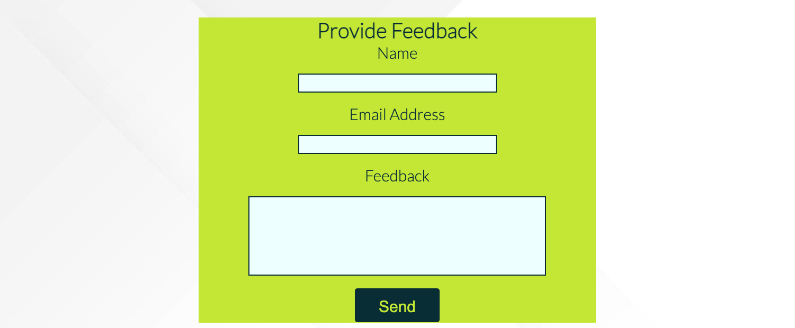

### Features Left to Implement
* A feature that I would like to implement in the future is to add a premium service where they can add more items and store all of the orders on a console page,

## Testing

* The site works on the following browsers
    * Google Chrome.
    * Safari.
    * Firefox.
* The three webpages were tested to be responsive as a desktop, tablet and mobile screensize,
* All images and text was reviewed and confirmed to be readable,
* The inputs and buttons work,
* The the form returns an email to the users inbox.

### Bugs
**Solved Bugs**
* When working with the images in the game they tended to not connect correctly with the button.
This was resolved by trial and error reviewing the js code. The arrey that was being indexed didnt line up with the order of the buttons. This caused it to mix the images. By correctly ordering the array this was resolved.

### Validator Testing
* HTML
    * No errors were found when passing the site pages through the [official W3C validator](https://validator.w3.org/)

    

Game

    
    

    

List

    
    

    

Form

    
    

* CSS
    * No errors were found when passing the site pages through the [official (Jigsaw) validator](https://jigsaw.w3.org/css-validator/)
    

Image

    
    

* Accessibility
    *    

Game

    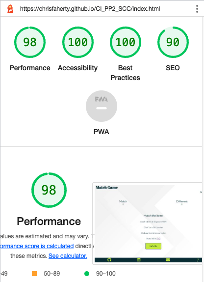
    

    

List

    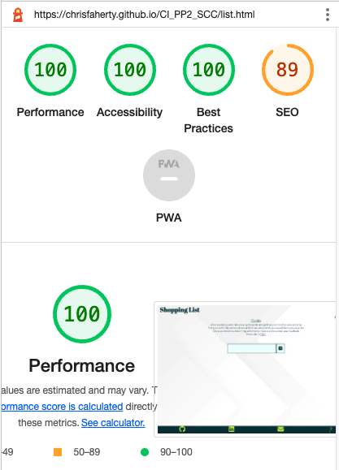
    

    

Form

    
    

    

Game

    
    

    

List

    
    

    

Form

    
    

* Performance
    * The performance was tested in lighthouse on the chrome browser on all pages.

    

Game

    
    

    

List

    
    

    

Form

    
    

* Java Script
    * No errors were found when passing the site pages through the [official (JShint) validator](https://jshint.com/)
    

Game

    
    

    

List

    
    

    

Form

    
    

### Testing user stories
1. As a first time user, I want to be able to intuatively tell how I use the app.

| **Feature** | **Action** | **Expected Results** | **Actual Result** |
|-------------|------------|----------------------|-------------------|
| Info | Read the info section | Locating the rules and start button | Works as expected |

Screenshots

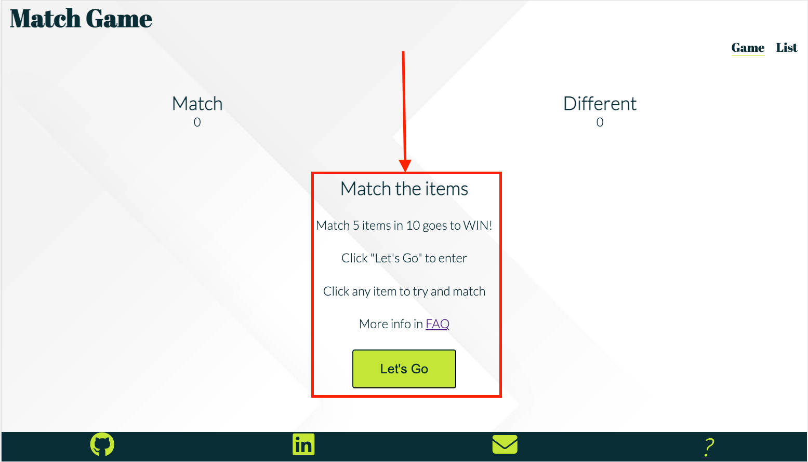

2. As a first time user, I want to be able to add remove and check list items.

| **Feature** | **Action** | **Expected Results** | **Actual Result** |
|-------------|------------|----------------------|-------------------|
| Shopping list | Click on list in the nav bar | Locating the shopping list page | Works as expected |
| Shopping list | Click on the + symbol on the list section | Creating a new line item | Works as expected |
| Shopping list | Click on the check mark or minus to mark or delete the line item | fades out or deletes line item | works as expected |

Screenshots

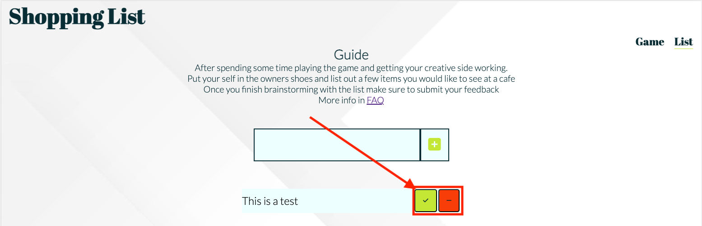

3. As a first time user, I want to know how to submit feedback.

| **Feature** | **Action** | **Expected Results** | **Actual Result** |
|-------------|------------|----------------------|-------------------|
| Feedback | Click on the evnalope icon in the footer | Opens the feedback page | Works as expected |
| Feedback | Fill out the form and click send off | Sends a response email to the users inbox| Works as expected |

Screenshots

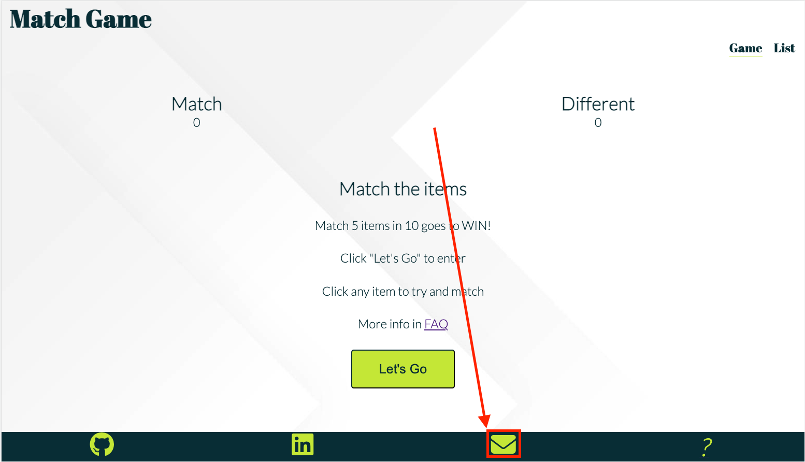

4. As a first time user, I want to know how to access and play the game.

| **Feature** | **Action** | **Expected Results** | **Actual Result** |
|-------------|------------|----------------------|-------------------|
| Game | Click on the let's go button  | reveals the game | Works as expected |

Screenshots

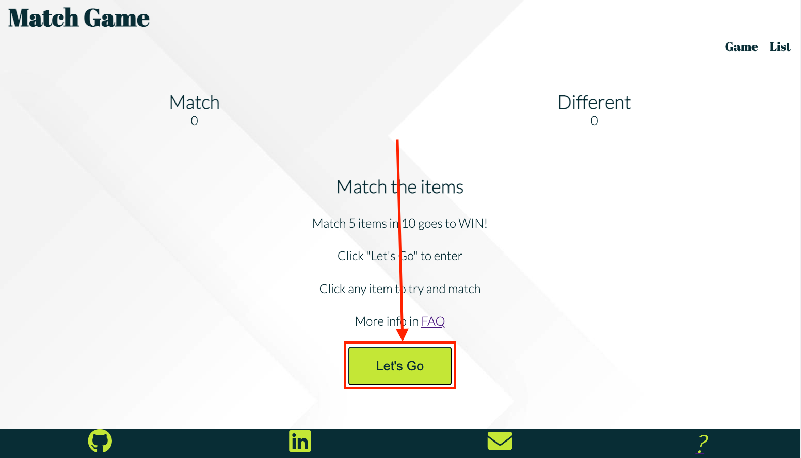

5. As a first time user, I want to be able to reset the game to play again.

| **Feature** | **Action** | **Expected Results** | **Actual Result** |
|-------------|------------|----------------------|-------------------|
| Game | Click on the let's go button  | reveals the game | Works as expected |
| Game | Click on the reset button | Resets score and images back to default | Works as expected |

Screenshots

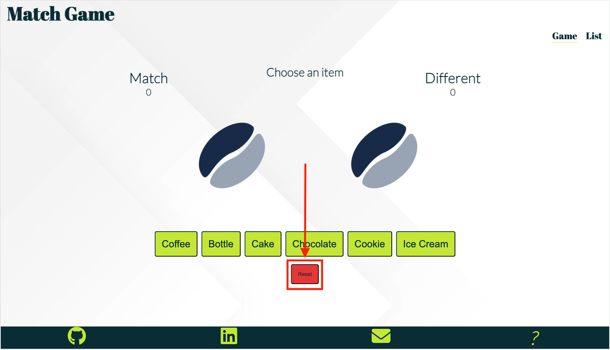

6. As a returning user, I want to be able to quickly add items again and check them of during the day. 

| **Feature** | **Action** | **Expected Results** | **Actual Result** |
|-------------|------------|----------------------|-------------------|
| Shopping list | Click on list in the nav bar | Locating the shopping list page | Works as expected |
| Shopping list | Click on the + symbol on the list section | Creating a new line item | Works as expected |
| Shopping list | Click on the check mark to mark the line item | fades out line item | works as expected |

Screenshots

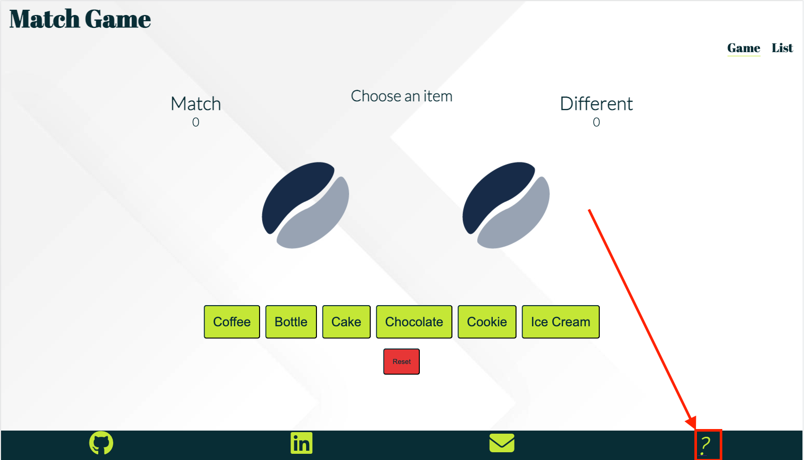

7. As a returning user, I want to be able to access the developers links.

| **Feature** | **Action** | **Expected Results** | **Actual Result** |
|-------------|------------|----------------------|-------------------|
| Footer | Scroll down to the footer section and select the github link | opens up the github depo | Works as expected|

Screenshots

8. As a returning user, I want to have a target score to beat the game,

| **Feature** | **Action** | **Expected Results** | **Actual Result** |
|-------------|------------|----------------------|-------------------|
| Info | on the info section it says what the target score is | Locating the target score | Works as expected|

Screenshots

9. As a returning user , I want to be able to submit feedback.

| **Feature** | **Action** | **Expected Results** | **Actual Result** |
|-------------|------------|----------------------|-------------------|
| Feedback | Click on the evnalope icon in the footer | Opens the feedback page | Works as expected |
| Feedback | Fill out the form and click send off | Sends a response email to the users inbox| Works as expected |

Screenshots

10. As the site owner, I want users to keep up to date with site updates,

| **Feature** | **Action** | **Expected Results** | **Actual Result** |
|-------------|------------|----------------------|-------------------|
| Github | Select the github icon opens up the github in a new Page | Locating the github repo with all the most recent updates | Works as expected|

Screenshots

11. As the site owner, I want users to be able to submit feedback.

| **Feature** | **Action** | **Expected Results** | **Actual Result** |
|-------------|------------|----------------------|-------------------|
| Packages | Scroll down to the packages section | Locating the four different packages | Works as expected|

Screenshots

12. As the site owner, I want users to be able to complete the tasks they require.

| **Feature** | **Action** | **Expected Results** | **Actual Result** |
|-------------|------------|----------------------|-------------------|
| Events | Scroll down to the events section | Locating the different weekly events | Works as expected|

Screenshots

13. As the site owner, I want users to be able to complete the tasks they require.

| **Feature** | **Action** | **Expected Results** | **Actual Result** |
|-------------|------------|----------------------|-------------------|
| Subscription | In the navigation bar select the subscribe link, Then you can fill out thr form to subscribe | Locating the subscription form | Works as expected|

Screenshots

Screenshots

### Unfixed Bugs
* There is no unfixed bugs.

## Deployment
* SSC Site was deployed to GitHub page,
* All commits and repositry info can be found on Git Hub,
* The process to deploy a site to GitHub pages is as follows:
    * Navigate to the settings tab at the top of the page in the navigation bar,
    * Select pages on the left hand side of the settings nav bar,
    * Once in pages the dropdown menu under branch select Main,
    * Then click save and your URL will be generated shortly,
    * Inorder to keep your deployed site up to date make sure to push your commits to GitHub.

## Credits
* Insperation was taken from dev eds with certain aspects of code. It is also commented in the code.
* W3Schools was also used for specific parts of the code.

### Media
* Icons - Font Awsome.
* Background - freepik.

## Acknowledgements
I would like to take the opertunity to thank:
* My Mentor Mo Shami for the great feedback productive meetings and guiding me to finishing this project.
* I would also like to thank the Code institute team for all the support and material to assist with this project.